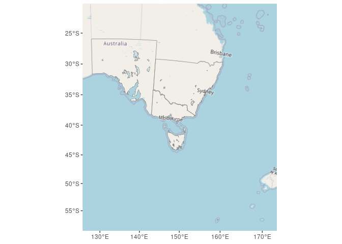
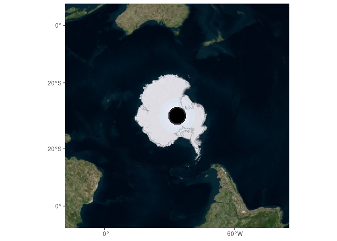
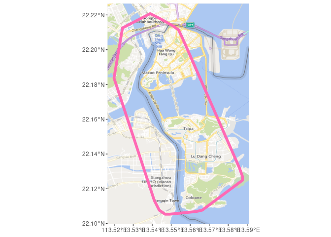
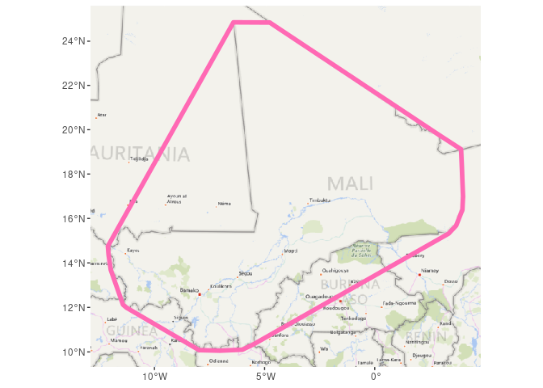
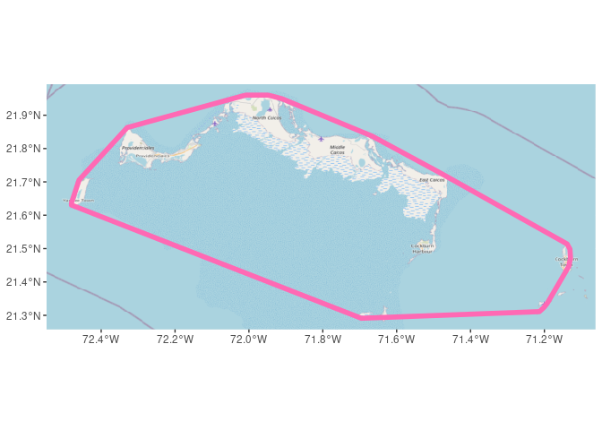
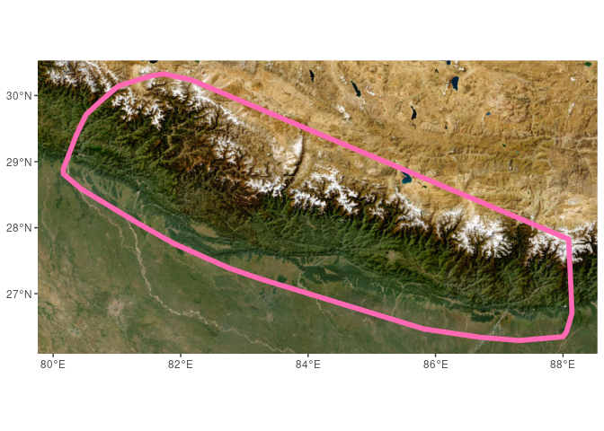
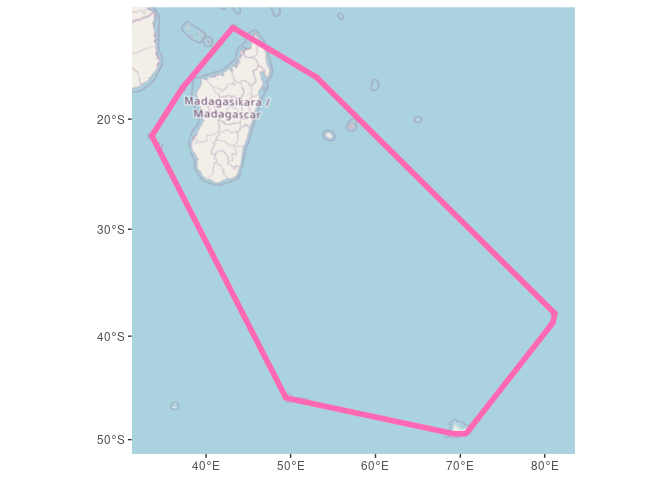

<!-- README.md is generated from README.Rmd. Please edit that file -->

# ggdal

<!-- badges: start -->

[](https://github.com/hypertidy/ggdal/actions/workflows/R-CMD-check.yaml)
<!-- badges: end -->

The goal of ggdal is to get background image data for ggplot2.

No futzing around with map tiles or zooms or other programs.

## Installation

You can install the development version of ggdal from
[GitHub](https://github.com/) with:

``` r
# install.packages("devtools")
devtools::install_github("hypertidy/ggdal")
```

# Example

Use ‘dsn = “osm”’ or “virtualearth”, or input custom data source, this
is a source readable by GDAL. Some examples are found in the sds package
available on [hypertidy/sds](https://github.com/hypertidy/sds.git).

Use any map projection. Currently examples only provided for use with sf
objects, WIP.

``` r
library(ggplot2)
library(ggdal)
data(iw)

ggplot() +
  annotation_gdal(dsn = "osm") +
  geom_sf(data = sf::st_transform(iw, "EPSG:3577"), fill = NA, col = "grey50")
```



``` r


ggplot() +
  annotation_gdal(dsn = "virtualearth") +
  geom_sf(data = sfdct::antarctica, fill = NA, col = "grey50") + coord_sf(xlim = c(-6378137, 6378137), 
                                                                          ylim = c(-6378137, 6378137))
#> old-style crs object detected; please recreate object with a recent sf::st_crs()
#> old-style crs object detected; please recreate object with a recent sf::st_crs()
```



## fun

For a bit of a lark, get your favourite dataset ‘x’ and run this code a
few times.

``` r
laea <- function(x) {
  bb <- sf::st_bbox(x)
  sf::st_transform(x, sprintf("+proj=laea +lon_0=%f lat_0=%f", mean(bb[c(1, 3)]),   mean(bb[c(2, 3)])))
}
x <- sf::read_sf("https://datahub.io/core/geo-countries/r/countries.geojson")
srcs <- c(sds::wms_openstreetmap_tms(), 
          sds::wms_virtualearth_street(), 
          sds::wms_arcgis_mapserver_ESRI.WorldImagery_tms())

for (i in 1:5) {
  i <- i + 1
plt <- ggplot() + 
  annotation_gdal(sample(srcs, 1)) + 
  geom_sf(data = laea(sf::st_convex_hull(dplyr::sample_n(x, 1))), fill = NA, colour = "hotpink", linewidth = 2)
print(plt)


}
```



## Code of Conduct

Please note that the ggdal project is released with a [Contributor Code
of
Conduct](https://contributor-covenant.org/version/2/1/CODE_OF_CONDUCT.html).
By contributing to this project, you agree to abide by its terms.
